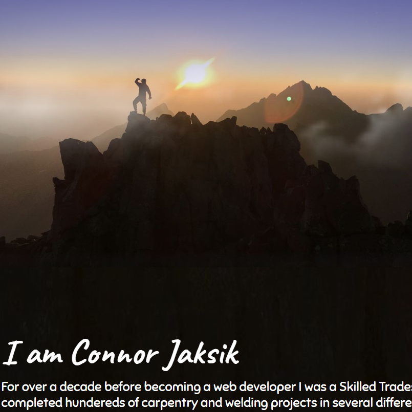

  

<h1 align="center">
  Connor Jaksik's Personal Portfolio
</h1>

Hello World. My name is Connor Jaksik. I'm a Full Stack Web Developer from Boulder, Colorado. This is the source code for my personal portfolio. Initially this project was created to showcase my web development skills, however the long-term goal is to showcase my other passions and achievements as well. This will also serve as a platform to make my career and life goals public to the world as a form of self-accountability.

_Checkout the live project at [connorjaksik.com](https://connorjaksik.dev)._

#### Future Development Preview
* Create a page for the each hobby and passion in my life that plays a major role in defining who I am.
..* Web Development
..* Mountaineering
..* Photography
..* Geography/Travel

## The Tech Stack

* Built with a React and Gatsby JS framework
* Hosted on Netlify
* Monitored with Google Analytics

## The Evolution of my Portfolio
* Over the first 12 months of being a web developer my skills improved consistently and rapidly. Every time that I reviewed my portfolio I knew that I could do better. From November 2018 to December 2019 I redesigned my portfolio 5 times and this is how it evolved.

    

    

    

    

    

